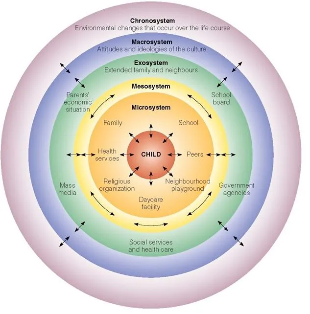

***

#### Psychosocial Theory

- 8 stages of development from birth to adulthood.

- All stages in a specific order, containing a crisis at each stage. needing resolution before the next stage.

- Failure to resolve the crisis at each stage would effect child's development at later stages.

| Developmental Stage              | Developmental Crisis           | Description of Crisis |
| :-------------------------------- | :------------------------------ | :-------------------------------------------------------|
| Birth - 1 year                   | Trust vs Mistrust              | Development of trust as a consequence of treatment. |
| 1 - 3 years                      | Autonomy vs Shame              | Learning to negotiate with parents to have needs and wants met. Development of a sense of independence. |
| 3 - 6 years                      | Initiative vs Guilt            | Learning how to play with others, lead and follow, as opposed to prevention from joining in through guilt or fear. |
| 6 years to adolescence           | Industry vs Inferiority        | Building of skills around play and obeying rules. Mastery of social skills, and self discipline. A mistrusting child will develop defeat and inferiority. |
| Adolescence (10 - 20 years)      | Identity vs Identity Diffusion | Children experiment with defiance and rule breaking. Also the time when a child will develop their sense of self and identity. |
| Young Adulthood (20 - 40 years)  | Intimacy vs Isolation          | A period of building long standing friendships and relationships. |
| Middle Adulthood (40 - 60 years) | Generativity vs Stagnation    | Becoming productive in society and setting an example for future generations. Developing interest in parenthood. |
| Old Age (60+ years)              | Integrity vs Despair           | Acknowledgement of prior achievement of the other stages and the recognition of integrity, as opposed to despair should one or more of the crises at previous stages not be resolved. |

**Evaluation of Psychosocial Theory**

- While insightful and plausible, no empirical evidence was gathered to develop theory.
- Erikson worked mainly with children, so his theory was based on this experience.
- The teen crisis was used to refer to the sensitivity of developmental meds at each stage, rather than a catastrophic event.
- Emphasises the role of psychological and social influence a development throughout a lifetime.

#### Behaviourism

Watson (1913) coined the term ‘behaviourism’, which is a theory assuming that behaviour is observable and can be traced back to other observable events. The goal of Behaviourism is to explain relationships between stimuli, responses and consequences.

Identified by many as being relevant regardless of age, and not being isolated to a particular "stage". The focus instead, is on stimulus/response and looking for predictable patterns of behaviour.

**Core Concepts:**

1. The Blank Slate: Children enter the world as a blank slate with ability to learn based on their
	environment.

2. Behavioural Focus: Concentrates on observable behaviours, and discovery of environmental stimuli responsible.

3. Environmental Determinism: A individuals behaviour is shaped by their environment rather than 'free will'.

4. Conditioning: The main process through which we learn.

Examples of behaviourism include: Pavlov's dogs (Classical Conditioning), Skinner's Pigeons (Operant Conditioning) and Bandura's Social Modelling or Social learning theory (Bobo Doll). The observation (of consequences), imitation, and modelling as demonstrated via the Bobo doll experiment (modelling and imitation of aggression). The experiment found that observations of aggressive behaviour influenced children towards acceptance of behaviours.

**Evaluation of behavioural theories**

- Empirical approach
- Attempts to demonstrate cause and effect
- Neglects rational thought processes.
- Does not address behaviours that are present in the absence of conditioning.
- Demonstration of hostile more likely to develop a hostile bias in future interactions.
- Some suggest that the setting is artificial. Demonstrating behaviours that were thought to be expected.
- Fails to determine if behaviours would be generalised in other scenarios.
- Primary focus on environmental factors, ignoring genetic disposition, sex based neurological differences.

####  Ethological Theory

(Darwin, Tinbergen, Burkhardt, Lorenz, Hinde, Ramey & Ramey)

Stresses that behaviour is strongly influenced by biology and evolution while also being mediated by sensitive periods. Emotions and thinking are heavily influenced by inherited factors. Charles Darwin's theory of evolution underpins this theory, stating that more than just physical attributes (hair and eye colour) influence us.

Also Posits that the selective pressures of an environment govern the development of the individual's traits and behaviour, rather than genetic make up. With a basis in Darwin's theory of natural selection, this theory originates in the observation of animals in their natural habitat rather than a lab. Others (Lorenz) in this field observed a critical period of development characterised by **imprinting** in animals, adapted to be known as a **sensitive period** in humans.

####  Bioecological Theory (Bronfenbrenner)

The Bioecological model focusses on individual development within a set of overlapping ecological systems. These systems influence the individual together as he/she develops.

1. Microsystem: Immediate social groups such as family, school, work and peers.
2. Mesosystem: The connection/interaction of 2 micro systems (parent/teacher interviews, birthday party, etc..)
3. Exosystem: Systems not requiring direct involvement which still exert an influence on the individual, such as newspapers, media, TV.
4. Macrosystem: Overarching systems which govern day to day lives, such as local council, state government, economy, culture.

The later addition of the Chronosystem addressed the influence of time to both historical events (war, recession, etc.) and the timing of life events (puberty, having children, getting married)

####  Life Course Theory

Four key concepts:

1. _Human lives situated in historical time and place_
    - _Cohort Effect:_ Posits that the effects of an event can influence the development of members across different birth cohorts in different ways.
    - _Period Effect:_ An historical event can influence the development of individuals across differing birth cohorts in a similar way.

2. _Developmental Studies must pay attention to the time of our lives_
    - Social roles and events can define our behaviours based on the period of our lives in which they occur. (e.g. teen mum vs 30 something mum)

3. _Human lives are interdependant and linked_
    - Connections with care givers and others significantly inform later relationships.

4. _Humans have the ability to make decisions and change our lives_
    - Our own decision making processes and choice of behaviour can impact the direction and pace of our development.

_Bronfenbrenner's theory focussed on the individual, while Elder's theory focussed on social environments._

***

Cognitive development theories

- Piaget's CDT
- Sociocultural Theory Development (Vygotsky)
- Info processing approach (Siegler)
  
